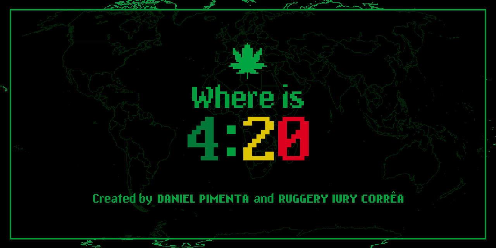

<a name="readme-top"></a>

<!-- PROJECT SHIELDS -->

[](https://github.com/daniel-pimenta-cc/whereis420)
[](https://github.com/daniel-pimenta-cc/whereis420/network/members)
[](https://github.com/daniel-pimenta-cc/whereis420/stargazers)
[](https://github.com/daniel-pimenta-cc/whereis420/issues)
[](https://github.com/daniel-pimenta-cc/whereis420/blob/main/LICENSE.txt)
[](https://www.linkedin.com/in/daniel-pimenta-cc/)

<!-- PROJECT LOGO -->

<br />
<div align="center">
  <a href="https://github.com/daniel-pimenta-cc/whereis420">
    
  </a>

<h3 align="center">Where is 4:20 ?</h3>

<p align="center">
    A website to show where in the world it is 4:20 or the next place it will be 4:20.
    <br />
    <a href="https://github.com/daniel-pimenta-cc/whereis420"><strong>Explore the docs »</strong></a>
    <br />
    <br />
    <a href="https://github.com/daniel-pimenta-cc/whereis420">View Demo</a>
    ·
    <a href="https://github.com/daniel-pimenta-cc/whereis420/issues">Report Bug</a>
    ·
    <a href="https://github.com/daniel-pimenta-cc/whereis420/issues">Request Feature</a>
  </p>
</div>

<!-- TABLE OF CONTENTS -->

<details>
  <summary>Table of Contents</summary>
  <ol>
    <li>
      <a href="#about-the-project">About The Project</a>
      <ul>
        <li><a href="#built-with">Built With</a></li>
      </ul>
    </li>
    <li>
      <a href="#getting-started">Getting Started</a>
      <ul>
        <li><a href="#prerequisites">Prerequisites</a></li>
        <li><a href="#installation">Installation</a></li>
      </ul>
    </li>
    <li><a href="#roadmap">Roadmap</a></li>
    <li><a href="#contributing">Contributing</a></li>
    <li><a href="#license">License</a></li>
    <li><a href="#contact">Contact</a></li>
  </ol>
</details>

<!-- ABOUT THE PROJECT -->

## About The Project

[![Product Name Screen Shot][product-screenshot]](https://example.com)

4:20 World Clock is a website that shows the next location in the world that will be 4:20. It was inspired by a joke with friends who always checked the time in different parts of the world when they smoked and "paid tribute" to that place. The site displays the next 4:20 time, and displays a funny animation of a joint if the time is between 4:20 and 4:30. Otherwise, it displays a countdown to the next 4:20. Additionally, the site always displays interesting information about the location, such as the local time.

### Future Features
*Add a collaborative playlist of songs for each country
*Add a visitor counter for each time zone

<p align="right">(<a href="#readme-top">back to top</a>)</p>

### Built With

* [](https://www.python.org/)
* [](https://html.spec.whatwg.org/multipage/)
* [](https://developer.mozilla.org/en-US/docs/Web/JavaScript)
* [](https://fastapi.tiangolo.com/)
* [](https://tailwindcss.com/)


<p align="right">(<a href="#readme-top">back to top</a>)</p>

<!-- GETTING STARTED -->

## Getting Started

To get a local copy up and running follow these simple example steps.

### Prerequisites

*Python
*FastAPI
*uvicorn

Before starting the project, make sure you have Python, uvicorn and FastAPI installed on your machine. These are the only tools required to run 4:20 World Clock. To install FastAPI, use the following command in your terminal:

* fastapi
  ```sh
  pip install fastapi
  ```

* uvicorn
  ```sh
  pip install uvicorn
  ```

### Installation


1. Clone the repo
   ```sh
   git clone https://github.com/daniel-pimenta-cc/whereis420.git
   ```
2. Enter the project folder 
   ```sh
   cd whereis420
   ```
3. Run 
   ```sh
   uvicorn main:app 
   ```

<p align="right">(<a href="#readme-top">back to top</a>)</p>

<!-- ROADMAP -->

## Roadmap

- [X] Finish first version
- [X] Launch
- [ ] Finish the mobile version
- [ ] Work on new features

See the [open issues](https://github.com/daniel-pimenta-cc/whereis420/issues) for a full list of proposed features (and known issues).

<p align="right">(<a href="#readme-top">back to top</a>)</p>

<!-- CONTRIBUTING -->

## Contributing

Contributions are what make the open source community such an amazing place to learn, inspire, and create. Any contributions you make are **greatly appreciated**.

If you have a suggestion that would make this better, please fork the repo and create a pull request. You can also simply open an issue with the tag "enhancement".
Don't forget to give the project a star! Thanks again!

1. Fork the Project
2. Create your Feature Branch (`git checkout -b feature/AmazingFeature`)
3. Commit your Changes (`git commit -m 'Add some AmazingFeature'`)
4. Push to the Branch (`git push origin feature/AmazingFeature`)
5. Open a Pull Request

<p align="right">(<a href="#readme-top">back to top</a>)</p>

<!-- LICENSE -->

## License

Distributed under the GNU General Public License v3.0. See `LICENSE.txt` for more information.

<p align="right">(<a href="#readme-top">back to top</a>)</p>

<!-- CONTACT -->

## Contact

Daniel Pimenta - [Linkedin](https://www.linkedin.com/in/daniel-pimenta-cc/) - danipimentasousa@gmail.com

Project Link: [https://github.com/daniel-pimenta-cc/whereis420](https://github.com/daniel-pimenta-cc/whereis420)

<p align="right">(<a href="#readme-top">back to top</a>)</p>


[product-screenshot]: Screenshot.png
